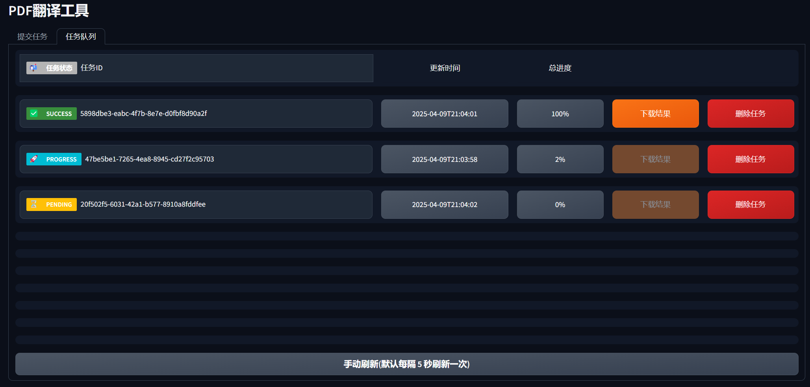

# PDF翻译工具

这是一个可以将 PDF 文件转换为 Markdown 格式并进行翻译的 Web 应用。

## 示例

界面展示


左侧为输入的 pdf，右侧为翻译后的 markdown 文件对比


任务监控与管理



## 功能特点

- 使用 MinerU magic-pdf 将 PDF 转换为 Markdown
  - 自动提取 PDF 中的图片
  - 自动转化 PDF 中的数学公式为 Latex
- 使用 DeepSeek API 进行翻译
  - 支持多种目标语言选择（中文、英文、日文、韩文）
  - 配置文件中可自定义 Prompts
- 打包下载转换结果、翻译结果和图片
- 可分布式部署多个 Worker
- 实时监控和管理任务队列

## 手工部署

### Worker

在 `worker` 目录下操作。

首先跟随[MinerU官方教程](https://github.com/opendatalab/MinerU?tab=readme-ov-file#quick-start)安装 magic-pdf。安装过程是需要[下载模型参数](https://github.com/papayalove/Magic-PDF/blob/master/docs/how_to_download_models_zh_cn.md)的，这些模型参数通过 huggingface_hub 下载，默认会存储在系统盘的 `~YourUser/.cache/` 目录下，请确保相关磁盘空间（或者或许能改存储路径）。

注意，若需要 GPU 加速，需要按照其指定要求的 CUDA 等的版本：
- [Windows](https://github.com/opendatalab/MinerU/blob/master/docs/README_Windows_CUDA_Acceleration_zh_CN.md)
- [Ubuntu](https://github.com/opendatalab/MinerU/blob/master/docs/README_Ubuntu_CUDA_Acceleration_zh_CN.md)

由于 magic-pdf 对环境要求比较严格，为了避免和其他依赖打架，最好给它单独创建一个环境安装，然后配置中填写其 `.../magic-pdf` 绝对路径。

> 目前 app 部分的 PyMuPDF 已经和 magic-pdf 的要求 冲突了

其他依赖安装：

```bash
pip install -r requirements.txt
```

配置说明如下：

在 `config.yaml` 文件中可以配置以下选项：

- `settings`: 应用设置
  - `cleanup_temp`: 是否在处理完成后删除临时文件

- `redis`: Redis 相关配置

- `api`: API相关配置
  - `base_url`: DeepSeek API的基础URL
  - `api_key`: DeepSeek API密钥
  - `model`: 使用的模型名称

- `paths`: 路径配置
  - `temp_dir`: 临时文件目录
  - `mineru_path`: MinerU可执行文件路径

- `prompts`: 翻译要求的 prompts


此外，安装好 magic-pdf 后，其配置文件在：`~YourUser/magic-pdf.json`。

确保 Redis 可以访问，参考 `config.yaml` 中的 redis 配置部署。最后启动 Worker 应用：

```shell
# 指定为 4 线程启动
celery -A celery_app.app worker --loglevel=info  --concurrency=4

# celery 在 Windows 尚不支持多线程，需要指定为单线程启动
celery -A celery_app.app worker --loglevel=info --pool=solo
```

### Web App

在 `app` 目录下操作。首先安装依赖：

```bash
pip install -r requirements.txt
```

配置说明如下

在 `config.yaml` 文件中可以配置以下选项：

- `settings`: 应用设置settings:
  - `queue_size`: 队列大小
  - `result_dir`: 临时存放任务结果文件的目录 

- `redis`: Redis 相关配置

确保 Redis 可以访问。Web App 将通过 Redis 来和 Worker 通信。最后启动应用：

```shell
python app.py
```

## docker compose 部署方案

通过 `app/docker-compose.yaml` 部署。

其中的 cloudflared 和其所需 token 的 `.env` 仅用于内网穿透暴露服务，若不需要可以移除。

此外，上述仅部署 Redis 和 Web App。而 Worker 由于不方便打包，环境配置较复杂，仍需要手工部署。
