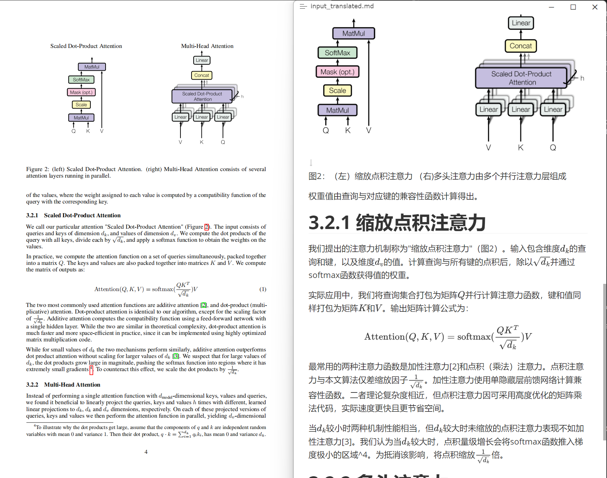

# PDF翻译工具

这是一个基于Gradio的Web应用，可以将PDF文件转换为Markdown格式并进行翻译。该工具使用MinerU进行PDF转换，使用DeepSeek API进行翻译。

## 示例

左侧为输入的pdf，右侧为翻译后的markdown文件




## 功能特点

- 支持PDF文件上传
- 支持多种目标语言选择（中文、英文、日文、韩文）
- 自动提取PDF中的图片
- 保持Markdown格式
- 打包下载翻译结果和图片
- 使用配置文件管理设置

## 安装依赖

跟随[MinerU官方教程](https://github.com/opendatalab/MinerU?tab=readme-ov-file#quick-start)安装magic-pdf


```bash
pip install -r requirements.txt
```

## 配置说明

在 `config.yaml` 文件中可以配置以下选项：

- `api`: API相关配置
  - `base_url`: DeepSeek API的基础URL
  - `api_key`: DeepSeek API密钥
  - `model`: 使用的模型名称

- `paths`: 路径配置
  - `temp_dir`: 临时文件目录
  - `mineru_path`: MinerU可执行文件路径

- `settings`: 应用设置
  - `cleanup_temp`: 是否在处理完成后删除临时文件

## 使用方法

1. 配置 `config.yaml` 文件（可选）

2. 运行应用：
```bash
python app.py
```

3. 在浏览器中打开显示的地址（默认为 http://localhost:7860）

4. 上传PDF文件，选择目标语言，点击"开始处理"

5. 等待处理完成后，下载包含翻译后Markdown文件和图片的zip包

## 注意事项

- 确保MinerU环境已正确配置
- 确保DeepSeek API密钥有效
- 处理大文件时可能需要较长时间
- 临时文件默认保存在项目根目录的 `tmp` 文件夹中 

